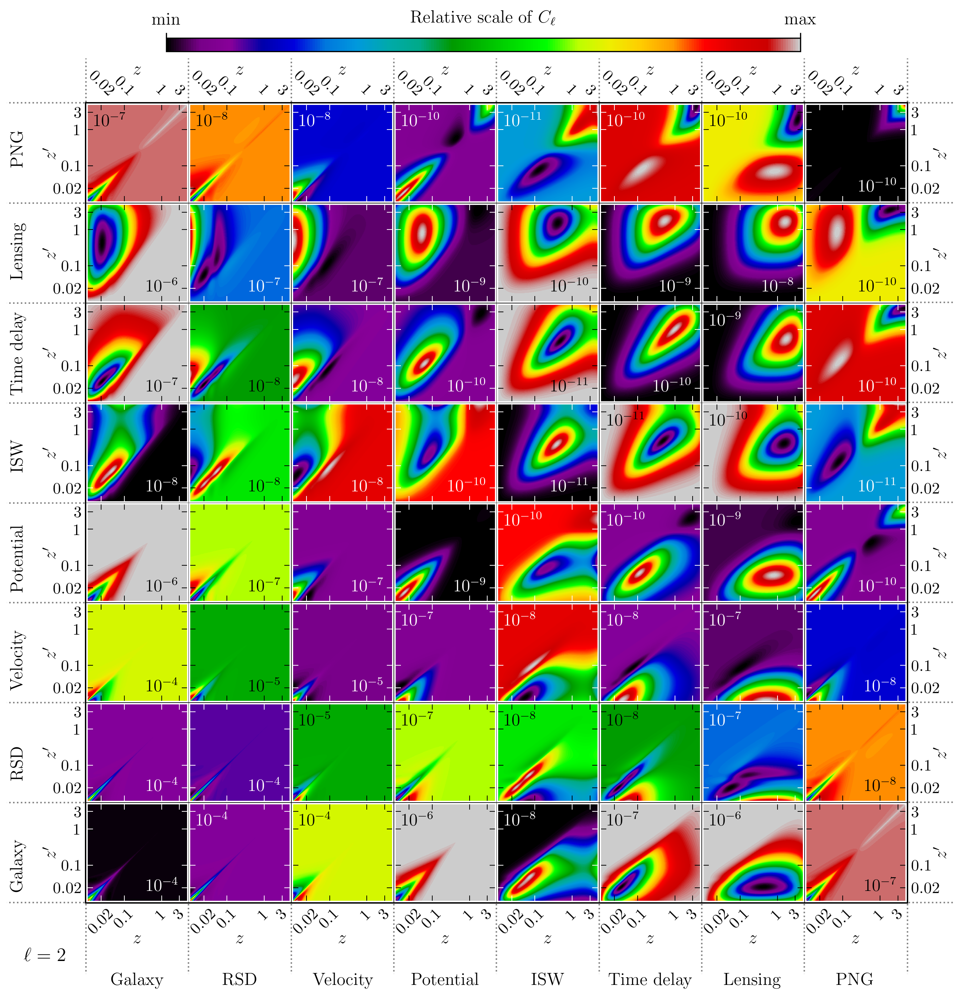
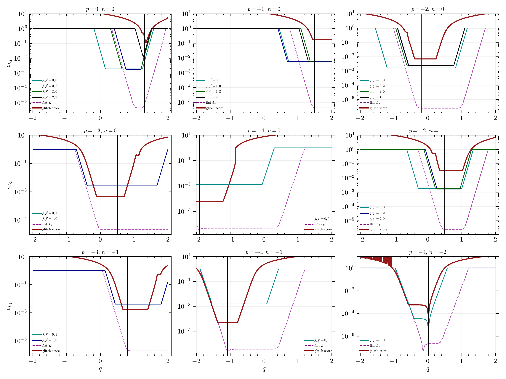
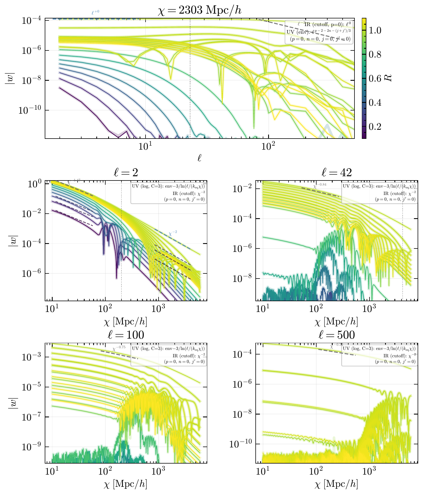
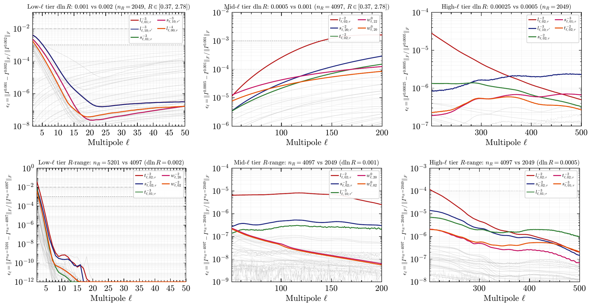
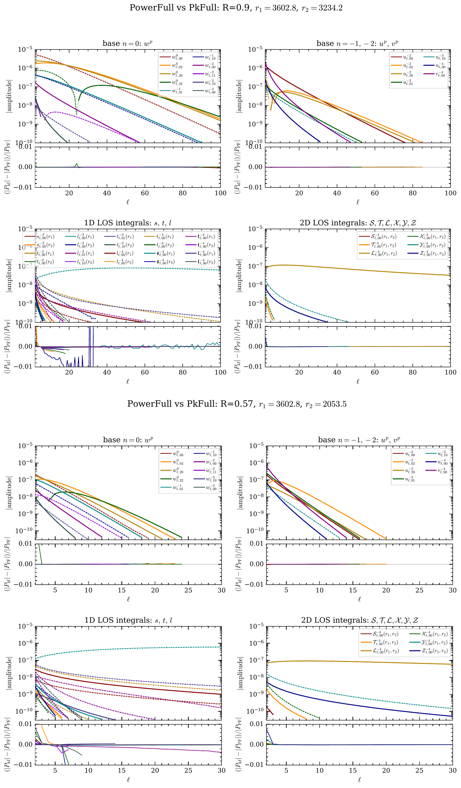

# PowerFull

Fast and accurate computation of the relativistic wide-angle galaxy angular
power spectrum, including local primordial non-Gaussianity.

**Reference**
Gregory Lukens and Donghui Jeong,
*"PowerFull: fast and accurate computation of the relativistic wide-angle
galaxy power spectrum including local primordial non-Gaussianity"*
(in preparation, 2026).

---

## Overview

`PowerFull` computes the observed angular power spectrum $C_\ell^{ij}$
including all general-relativistic corrections — density, RSD, Doppler,
magnification, lensing–lensing, evolution bias, and local-$f_{\rm NL}$
scale-dependent bias — for arbitrary pairs of galaxy samples and
redshift bins.  The calculation is exact (no Limber approximation) and
is organized as a three-step pipeline:

1. **TwoFAST** (`src/run_twofast.jl`) — compute the $(p,n,j,j')$ base
   functions $w^{p,n}_{\ell,jj'}(r, R)$ on a logarithmic $R$-grid via
   FFTLog of a spherical-Bessel integrand.
2. **Build & export** (`src/build_and_export.jl`) — interpolate the
   base functions onto the target $(r_1, r_2)$ grid, accumulate the
   cumulative line-of-sight integrals, and write 61 integral arrays
   to a split HDF5 (meta + part files).
3. **Assemble $C_\ell^{ij}$** (`src/compute_ClGR.jl`) — convolve the
   stored integrals with per-sample tracer weights and sum the 19 GR
   contributions into the observed $C_\ell^{ij}$.

Step 3 supports two modes:

- **Single pair**: `--tracer-1=...` (auto) or `--tracer-1=... --tracer-2=...`
  (cross).
- **Multi-pair** (shared-I/O production): `--tracer-list=<file>.txt
  --pairs=i-j,k-l,...`.  A single streaming pass over the integrals
  computes every requested pair at near-constant I/O cost
  (~3 s compute/pair after the first; 120 tomographic pairs run in
  ≈ 9 min vs ~8 h serial).

A standalone Python reader (`python/calcClGR.py`) performs Step 3 only,
for users who want to consume the HDF5 output from Python.

## Naming convention for stored arrays

The HDF5 output writes the paper's full observables under the same
symbol names used in the paper.  For lensing-related arrays
(`l_*`, `scrl_*`, `scrL_*`, `scrY_*`, `scrZ_*`) the
$(r-r'')/(r\,r'')$ geometric factor and the $\ell(\ell+1)/2$ prefactor
are folded in during the build's paper-observable post-pass; downstream
code (Python reader, `compute_ClGR.jl`) reads them directly without
further conversion.  Non-lensing arrays (`s`, `t`, `scrS`, `scrT`,
`scrX`) match the paper's symbols directly.

Older builds may still carry the legacy *tilde* prefix
(`tl_*`, `tscrL_*`, `tscrY_*`, `tscrZ_*`, `tscrl_*`) on the lensing
blocks; in that case `calcClGR.jl` applies the paper-observable
conversion at load time.  To re-export an existing tilde-keyed build
to paper-key layout, run `scripts/apply_paper_pp_inplace.jl <build_root>`
(or re-build from step1 jld2 files with `build_and_export.jl`).

## Tracer definition

A `Tracer` holds four functions of redshift — the galaxy bias $b_g(z)$,
the evolution bias $b_e(z)$, the magnification $Q(z)$, and the radial
selection $\phi(z)$ normalized to $\int \phi(z)\,dz = 1$.  The
scale-dependent bias $b_\Phi(z)$ is optional; when omitted the driver
uses $b_\Phi(z) = 2\,\delta_c\,(b_g(z) - 1)$ with $\delta_c = 1.686$.

The minimal tracer HDF5 schema is a flat set of equal-length vectors on
a common $z$ grid: `/z`, `/bg`, `/be`, `/Q`, `/phi`, plus optional
`/bPhi`.

```bash
# Single-pair auto-spectrum
julia -t N --project src/compute_ClGR.jl \
    ClGR_output_meta.h5 Cl_i_i.h5 \
    --tracer-1=tracer_i.h5 [--fNL=1.0]

# Single-pair cross-spectrum
julia -t N --project src/compute_ClGR.jl \
    ClGR_output_meta.h5 Cl_i_j.h5 \
    --tracer-1=tracer_i.h5 --tracer-2=tracer_j.h5 [--fNL=1.0]

# Multi-pair full tomography (shared I/O; 120 pairs in ~9 min at -t 4)
julia -t 4 --project src/compute_ClGR.jl \
    ClGR_output_meta.h5 Cl_all_pairs.h5 \
    --tracer-list=tracers.txt \
    --pairs=1-1,1-2,1-3,2-2,2-3,3-3,... [--fNL=1.0]
```

Step 3 streams one integral array at a time from the split HDF5; peak
memory stays near 15 GB regardless of total HDF5 size, so the
$N_r = 4096$ production set (~150 GB) fits on a 40–96 GB node.

## Examples

- `examples/spherex_paper_example.jl` — build one tracer h5 from the
  SphereX paper inputs (Gaussian window × comoving $\bar n_g$ shape,
  normalized to $\int \phi(z)\,dz = 1$).
- `examples/generate_spherex_tracers.jl` — loop over SphereX samples
  and z-bins to produce 15 tracer h5 files plus a ready-to-use
  `tracer_list_prod.txt` and `--pairs` spec for the full 120-pair
  tomographic production.
- `examples/compare_cl_limber.jl` — density-only + κ-only Limber
  cross-check of $C_\ell^{ii}$; documents the fraction of the signal
  that Limber misses for narrow-$\sigma_z$ bins (used for the paper's
  "why not Limber" figure).

## SLURM templates

The recommended production workflow is the **3-tier pipeline** under
`examples/slurm/`.  Five scripts cover the full chain from TwoFAST
radial integrand to per-pair $C_\ell^{ij}$:

```
step1_tier_low.slurm   →   ell = 2..50    (dlnR=0.002,  nR=4097)
step1_tier_mid.slurm   →   ell = 51..200  (dlnR=0.001,  nR=2049)
step1_tier_high.slurm  →   ell = 201..500 (dlnR=0.0005, nR=2049)
        │                  (the three step1 jobs run in parallel)
        ▼
step2_build_3tier.slurm  →  production/ClGR_production_{meta,part_*}.h5
        │
        ▼
step3_compute_cl.slurm   →  per-pair C_ℓ result file
```

| Script | Purpose | Cores | Memory | Wall |
|--------|---------|-------|--------|------|
| `examples/slurm/step1_tier_low.slurm`  | step1 low-ell (ell=2-50) | 64 | 200 GB | ~30 min |
| `examples/slurm/step1_tier_mid.slurm`  | step1 mid-ell (ell=51-200) | 64 | 300 GB | ~1 h |
| `examples/slurm/step1_tier_high.slurm` | step1 high-ell (ell=201-500) | 64 | 400 GB | ~2 h |
| `examples/slurm/step2_build_3tier.slurm` | step2 unified 3-tier build | 24 | 400 GB | ~1 h |
| `examples/slurm/step3_compute_cl.slurm` | step3 streaming $C_\ell$ | 16 | 40 GB | ~30 min |

All five scripts use the plikHM matterpower (`data/planck_base_plikHM_…
_matterpower.dat`) for cosmology consistency with the validation suite.

Submission (the three step1 jobs run in parallel; chain step2/step3 by
hand or with `--dependency=afterok:`):

```bash
cd /path/to/PowerFull.jl
sbatch examples/slurm/step1_tier_low.slurm
sbatch examples/slurm/step1_tier_mid.slurm
sbatch examples/slurm/step1_tier_high.slurm
# Wait for all three to finish, then:
sbatch examples/slurm/step2_build_3tier.slurm
# Edit TRACER and OUTPUT inside the script first:
sbatch examples/slurm/step3_compute_cl.slurm
```

See `examples/slurm/README.md` for resource sizing details, the
cosmology policy, and the full output file map.

Several other SLURM templates under `scripts/` (multi-pair tomography
runs, dlnR/Rcut convergence tests, single-tier variants) are kept for
historical and validation work; the 3-tier `examples/slurm/` flow is
the canonical production entry point.

Site-specific SBATCH overrides apply to every script via environment
variables (no script edit needed):

| Variable | Effect |
|----------|--------|
| `SBATCH_PARTITION` | sets the partition for every job |
| `SBATCH_ACCOUNT` | sets the SLURM account/project |
| `REPO` | overrides the repo root path; defaults to `$SLURM_SUBMIT_DIR` or `$(pwd)` |

## Requirements

- Julia ≥ 1.11
- Packages in `Project.toml` (install via
  `julia --project -e 'using Pkg; Pkg.instantiate()'`)
- Step 1: Distributed workers (`julia -p N`); memory scales with $N_r$
  and $N_R$.
- Steps 2 and 3: shared-memory threads (`julia -t N`).
- Python reader: `numpy`, `h5py`, `scipy`, `matplotlib`.

## Performance: thread sweet spots

Measured on a 64-core grammar (ICS-ACI) node at $N_r = 4096$,
$n_R = 2049$, 499 ell values (ell = 2..500).  These are the values used
in the SLURM templates in `scripts/`:

| Step | Thread / worker count | Why |
|------|----------------------|-----|
| **Step 1** `run_twofast.jl` | `-p 8` (distributed) × `JULIA_NUM_THREADS=6` | One tier ≈ 30 min – 2 h (warm F21/Ml cache).  3-tier production templates use 8 workers × 6 threads = 48 cores. |
| **Step 2** `build_and_export.jl` | `-t 24` (threaded) | **Compute-bound**; speedup plateaus at 24 due to the ~43 % serial fraction (Amdahl ceiling ≈ 2.3×). 151 GB HDF5 output in ≈ 11 min. |
| **Step 3** `compute_ClGR.jl` | `-t 4` (threaded) | **I/O-bound**; 61 Float32 slices per part (~7 GB) dominate wall time, compute kernel amortizes across pairs. 15 pairs in 2:47, 120 pairs in 8:55. |

Running Step 3 at `-t 24` is _slower_ than `-t 4` because the HDF5
read throughput saturates well below that; the extra threads only
contend for the shared GC. Likewise Step 2 at `-t 4` is ~2× slower
than `-t 24` because the inner accumulation kernel benefits from the
full thread pool.

The Ml / F21 caches produced by Step 1 (`Cacheout_nR=..._dlnR=...`,
1.6 TB across the three tiers at $N_r = 4096$) are cosmology-independent
— they depend only on the grid `(N_r, n_R, \mathrm{dlnR}, \ell_{\max})`
and the `q` list — so keeping them on disk across cosmology sweeps pays
off quickly (cold vs warm tier wall time differs by a factor of ~50).

### Streaming MlCache (`--streaming-mlcache`)

For one-off runs and machines without 1+ TB of free disk, Step 1
supports a streaming mode that fuses the $M_\ell$ backward recurrence
with the $\phi \times \mathrm{brfft}$ consumer in a single loop, so the
`MlCache.bin` files are never written or read.  Pass
`--streaming-mlcache` to `run_twofast.jl`:

```bash
julia --project -p 8 src/run_twofast.jl \
    --Nr=4096 --nR=4097 --dlnR=0.002 \
    --ellmin=2 --ellmax=199 --ellmax-margin=210 \
    --outdir=./results/tier_a \
    --streaming-mlcache
```

At tier-A parameters ($N_r{=}4096$, $n_R{=}4097$, $\ell{=}2{-}210$,
threading 6×9) the streaming mode runs in ≈ 28 min vs ≈ 2 h 24 min for a
fresh disk build (no MlCache reuse), with ε-level numerical agreement
(rel $\lesssim 2.2 \times 10^{-15}$).  Default is OFF; the disk pipeline
remains the reference for sweeps that benefit from cache reuse.

### Production tiers (3-tier: low + mid + high)

The current production split is three tiers; each step1 job runs
independently and they are stitched in step2:

| Tier | $\ell$ range | dlnR | $n_R$ | rationale |
|------|--------------|------|-------|-----------|
| `tier_low`  | $[2, 50]$     | $0.002$  | $4097$ | dense $R$-grid at low ell where the integrand peaks broadly |
| `tier_mid`  | $[51, 200]$   | $0.001$  | $2049$ | refines the high-$R$ tail at moderate ell |
| `tier_high` | $[201, 500]$  | $0.0005$ | $2049$ | finest $R$-grid where the Bessel rings tighten |

`build_and_export.jl` accepts an optional fourth field on `--tier=` for
per-tier $n_R$:

```bash
julia --project -t 24 src/build_and_export.jl \
    --Nr=4096 \
    --tier=0.002,2,50,4097 \
    --tier=0.001,51,200,2049 \
    --tier=0.0005,201,500,2049 \
    --datadir=./data --outname=./ClGR_production
```

Three-field `--tier=dlnR,ellmin,ellmax` falls back to the global `--nR`
for backwards compatibility.  The validation tree in `validation/`
documents the convergence behavior of this split.

## Quick start

Three step1 invocations (one per tier), one step2 build, one step3
$C_\ell$ assembly.  Each command matches the corresponding SLURM script
under `examples/slurm/` line by line; pick the form that fits your
environment.

```bash
# 1. Instantiate the Julia environment (once).
julia --project -e 'using Pkg; Pkg.instantiate()'

# 2. Compute the TwoFAST base functions, one tier at a time.
#    The three commands are independent and can run in parallel.
JULIA_NUM_THREADS=6 julia --project -p 8 src/run_twofast.jl \
    --Nr=4096 --nR=4097 --dlnR=0.002 \
    --ellmin=2 --ellmax=50 --ellmax-margin=60 \
    --matterpower=data/planck_base_plikHM_TTTEEE_lowTEB_lensing_post_BAO_H070p6_JLA_matterpower.dat \
    --cosmo-funcr=data/cosmo_funcr.txt \
    --outdir=./results/tier_low --streaming-mlcache

JULIA_NUM_THREADS=6 julia --project -p 8 src/run_twofast.jl \
    --Nr=4096 --nR=2049 --dlnR=0.001 \
    --ellmin=51 --ellmax=200 --ellmax-margin=210 \
    --matterpower=data/planck_base_plikHM_TTTEEE_lowTEB_lensing_post_BAO_H070p6_JLA_matterpower.dat \
    --cosmo-funcr=data/cosmo_funcr.txt \
    --outdir=./results/tier_mid --streaming-mlcache

JULIA_NUM_THREADS=6 julia --project -p 8 src/run_twofast.jl \
    --Nr=4096 --nR=2049 --dlnR=0.0005 \
    --ellmin=201 --ellmax=500 --ellmax-margin=510 \
    --matterpower=data/planck_base_plikHM_TTTEEE_lowTEB_lensing_post_BAO_H070p6_JLA_matterpower.dat \
    --cosmo-funcr=data/cosmo_funcr.txt \
    --outdir=./results/tier_high --streaming-mlcache

# 3. Stage the tier outputs into one datadir and assemble the integrals.
mkdir -p ./data
for d in ./results/tier_low ./results/tier_mid ./results/tier_high; do
    ln -sf $(readlink -f $d)/TwoFAST_*.jld2 ./data/
done
julia --project -t 24 src/build_and_export.jl \
    --Nr=4096 \
    --tier=0.002,2,50,4097 \
    --tier=0.001,51,200,2049 \
    --tier=0.0005,201,500,2049 \
    --datadir=./data --outname=./ClGR_production \
    --cosmo-funcr=data/cosmo_funcr.txt

# 4. Build a tracer h5 for the bin(s) you want (SphereX example).
julia --project examples/generate_spherex_tracers.jl

# 5. Compute the full 120-pair tomographic C_ℓ matrix.
PAIRS=$(julia -e '
    ps = String[]
    for i in 1:15, j in i:15; push!(ps, "$i-$j"); end
    print(join(ps, ","))')
julia --project -t 4 src/compute_ClGR.jl \
    ClGR_production_meta.h5 Cl_spherex_full.h5 \
    --tracer-list=examples/tracer_list_prod.txt \
    --pairs=$PAIRS --fNL=1.0 \
    --cosmo-funcr=data/cosmo_funcr.txt
```

For the SLURM-submitted version of the same pipeline, see
`examples/slurm/README.md`.

## Validation tools

- `src/validate_limber.jl` — compare the 24 stored LOS integrals
  against their Limber-limit predictions.  Useful high-$\ell$ sanity
  check at the integrand layer.
- `examples/compare_cl_limber.jl` — compare the observed $C_\ell^{ii}$
  against pure-density and pure-$\kappa$ Limber predictions.  The
  residual (typically 50% at $\ell = 500$ even for narrow-$\sigma_z$
  bins) documents the contribution of Kaiser RSD, magnification,
  Doppler, and evolution bias that Limber drops.
- `test/runtests.jl` — module-level unit tests.

## Directory layout

```
PowerFull/
├── src/                        Core Julia code
│   ├── PowerFull.jl            Main module (TwoFAST I/O, base interpolation)
│   ├── PowerFull_interp.jl     Optimized R-interpolation helper
│   ├── cosmofns.jl             Cosmology distances, growth, P(k)
│   ├── calcClGR.jl             Assembly module (19-term C_ℓ, multi-pair kernel)
│   ├── run_twofast.jl          Step 1 driver (distributed TwoFAST)
│   ├── build_and_export.jl     Step 2 driver (split HDF5 export)
│   ├── compute_ClGR.jl         Step 3 driver (single- and multi-pair)
│   ├── validate_limber.jl      Limber-limit validation of stored integrals
│   └── TwoFASTpp/              Modified TwoFAST (FFTLog + Miller recurrence;
│                               see TwoFASTpp/README.md for attribution)
├── scripts/                SLURM submission templates and chain script
├── examples/                   SphereX tracer generator, Limber cross-check
├── data/                       Cosmology table, CAMB P(k)
├── python/                     Standalone C_ℓ reader (no Julia required)
└── test/                       Unit tests
```

## Cosmology and input data

Two Planck 2018 cosmologies ship under `data/`:

| Cosmology | Matterpower | Cosmofn table | $\Omega_{m,0}$ |
|-----------|-------------|---------------|----------------|
| **plikHM** (production / validation default) | `data/planck_base_plikHM_TTTEEE_lowTEB_lensing_post_BAO_H070p6_JLA_matterpower.dat` | `data/cosmo_funcr.txt` | 0.30821 |
| **astropy** (alternative) | `data/astropy_planck_2018_matterpower.dat` | `data/cosmo_funcr_astropy_planck2018.txt` | 0.31108 |

The production SLURM templates under `examples/slurm/` and every test
under `validation/` use **plikHM** for cross-consistency; the two
matterpowers differ by ~3 % in `w_0_22` at low ell, which is large
enough to dominate $10^{-4}$-level validation comparisons.  **Do not
mix the two within one pipeline** — match the matterpower and cosmofn
that share a row in the table.

To use a different cosmology, replace either file with an output in
the same format and pass `--cosmo-funcr=<path>` and
`--matterpower=<path>` to the drivers.

## Numerical validation

PowerFull builds on the FFTLog techniques developed in
[2-FAST](https://github.com/hsgg/TwoFAST.jl).

### Relativistic contributions at low multipoles

### Relativistic contributions at low multipoles



*Relative contribution of the individual terms entering the full relativistic angular galaxy power spectrum at ℓ = 2. The 8×8 matrix shows the auto- and cross-contributions among the eight physical terms included in PowerFull, illustrating the hierarchy of density, velocity, potential, integrated, and primordial non-Gaussianity contributions on ultra-large scales.*


### FFTLog bias-parameter optimization



*Error diagnostics as a function of the FFTLog bias parameter q for the nine (p, n) base-integral families used by PowerFull. Solid colored curves show the maximum error metric within each (j, j′) sub-block, while the additional diagnostics identify plateaus and localized numerical artifacts. The vertical black line marks the adopted q★ for each base.*


### Comparison with the Lucas algorithm



*Comparison of the TwoFAST evaluation of the radial base integrals with an independent implementation of the Lucas oscillatory-integration algorithm. The comparison spans representative multipoles, radial separations, and distance ratios R, with the two calculations agreeing at sub-percent level over the tested range.*


### Radial-grid convergence



*Convergence tests for the logarithmic radial-ratio grid used in the PowerFull implementation. The calculation is tested separately against changes in the total R range and in the grid spacing d ln R, demonstrating numerical stability of the stored base and line-of-sight integrals over the production ranges.*


### Independent PowerFull validation



*Independent validation of the PowerFull integral basis at representative distance ratios R = 0.9 and R = 0.57. The two-point bases are compared against direct Lucas integration, while the one- and two-dimensional line-of-sight projections are compared against the independent PkFull FORTRAN implementation. Residuals are generally at the 10⁻⁵ level for the direct two-point bases, with the largest deviations arising in the most challenging low-ℓ lensing contribution.*

## License

MIT.  See `LICENSE`.

## Citation

If you use PowerFull in a publication, please cite the reference above.
